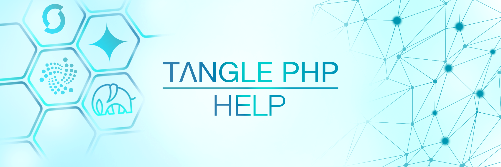

> #### Please be aware that this Examples are in an early development state and the API of the library as well as the "Stardust" protocol is subject to change, it is NOT ready to use in production.

<a href="https://discord.iota.org/" style="text-decoration:none;"></a>
<a href="https://twitter.com/tanglePHP/" style="text-decoration:none;"></a> ‖
<a href="https://www.tanglephp.com/" style="text-decoration:none;"></a>
<a href="https://www.iota.org/" style="text-decoration:none;"></a>
<a href="https://www.shimmer.network/" style="text-decoration:none;"></a> ‖
<a href="https://www.php.net/" style="text-decoration:none;">= 8.1.x-blue?style=flat-square&logo=php" alt=">PHP 8"></a>
<a href="https://github.com/iota-community/iota.php/LICENSE" style="text-decoration:none;"></a>

---

## SingleNodeClient - searchTag

You can search for an index/tag in the tangle, using the "search" action in tanglePHP. An array with the required data is returned as the return value.

Please note that in v2 only tags created with a StorageDeposit will be found. In v1, index payloads will only be available for a limited time.

---

## Use in tanglePHP

#### Support: Shimmer (v2) & IOTA (v1)


```PHP
 // include tanglePHP autoload from tanglePHP/bundle
  require_once("autoload.php");

  use tanglePHP\Network\Connect;
  use tanglePHP\SingleNodeClient\Action\search;

  // create network connection
  $network = new Connect('shimmer:testnet');
  // seach index/tag
  echo $ret = (new search($network->singleNode))->tag('#tanglePHP')
                                                ->parseItemList(true)
                                                ->run();
```

---

### Output initial information
Below is an example of the return:

```PHP
  # output
      // print single information
      echo PHP_EOL;
      echo "Found: " . $ret->count . PHP_EOL;
      print_r($ret->items);
      echo PHP_EOL;
      print_r($ret->first);
      echo PHP_EOL;
      print_r($ret->last);
  
  /* Output example
    {"count":14,"items":[{"item":"0xa6fa494977c3adc40b3c878d45effad6605c87dab5418bdcb6cfab787f2871570000","explorerUrl":"https:\/\/explorer.shimmer.network\/testnet\/block\/0xa6fa494977c3adc40b3c878d45effad6605c87dab5418bdcb6cfab787f2871570000","blockId":"0xd6596daa794d69af51e80916e4d6a0fe954c8c61ad39d147029a37d91865f192","transactionId":"0xa6fa494977c3adc40b3c878d45effad6605c87dab5418bdcb6cfab787f287157","amount":"1000000","data":{"hex":"0x7472616e73616374696f6e20746573742120666f6c6c6f77206d65206f6e2054776974746572204074616e676c65504850","plain":"transaction test! follow me on Twitter @tanglePHP","array":[]}},{"item":"0x1b279f70abc3fdbd2aceeba70e5f5d466c3d08b7e706aff26738e94f7d31cc190000","explorerUrl":"https:\/\/explorer.shimmer.network\/testnet\/block\/0x1b279f70abc3fdbd2aceeba70e5f5d466c3d08b7e706aff26738e94f7d31cc190000","blockId":"0x85ac85ec85f4bc44d2f10a24a37f312d70e6d6d2562bc9329e78058cbc07fa61","transactionId":"0x1b279f70abc3fdbd2aceeba70e5f5d466c3d08b7e706aff26738e94f7d31cc19","amount":"1000000","data":{"hex":"0x7472616e73616374696f6e20746573742120666f6c6c6f77206d65206f6e2054776974746572204074616e676c65504850","plain":"transaction test! follow me on Twitter @tanglePHP","array":[]}},{"item":"0x83f671fdcd9e22f098986197795781c85e9a08f9a4ec169e4d24e801bf14d2c30000","explorerUrl":"https:\/\/explorer.shimmer.network\/testnet\/block\/0x83f671fdcd9e22f098986197795781c85e9a08f9a4ec169e4d24e801bf14d2c30000","blockId":"0xab73fb5e25762204bef883c4a9211ba33637975acc0684afae28ffd2312e90aa","transactionId":"0x83f671fdcd9e22f098986197795781c85e9a08f9a4ec169e4d24e801bf14d2c3","amount":"1000000","data":{"hex":"0x7472616e73616374696f6e20746573742120666f6c6c6f77206d65206f6e2054776974746572204074616e676c65504850","plain":"transaction test! follow me on Twitter @tanglePHP","array":[]}},{"item":"0xd81469427e2badf1a08d78fe838d34661d231484d2a4db9c699af2000373f84a0000","explorerUrl":"https:\/\/explorer.shimmer.network\/testnet\/block\/0xd81469427e2badf1a08d78fe838d34661d231484d2a4db9c699af2000373f84a0000","blockId":"0x4653f6d173e12cf3df0264db62921cf2d8581266567ec79b3b635f2b583b0fc1","transactionId":"0xd81469427e2badf1a08d78fe838d34661d231484d2a4db9c699af2000373f84a","amount":"1000000","data":{"hex":"0x7472616e73616374696f6e20746573742120666f6c6c6f77206d65206f6e2054776974746572204074616e676c65504850","plain":"transaction test! follow me on Twitter @tanglePHP","array":[]}},{"item":"0x25edd503b8ea2f4bfd818afb56d3c98e08e59ac867d85e305f307552ae445af30000","explorerUrl":"https:\/\/explorer.shimmer.network\/testnet\/block\/0x25edd503b8ea2f4bfd818afb56d3c98e08e59ac867d85e305f307552ae445af30000","blockId":"0x95190ec30512869ff278f01464c03aaa446c8a896e2d190e9884e5575127c90e","transactionId":"0x25edd503b8ea2f4bfd818afb56d3c98e08e59ac867d85e305f307552ae445af3","amount":"1000000","data":{"hex":"0x7472616e73616374696f6e20746573742120666f6c6c6f77206d65206f6e2054776974746572204074616e676c65504850","plain":"transaction test! follow me on Twitter @tanglePHP","array":[]}},{"item":"0xa22fa5df7fe1c5f956b1b772c32aa138715d48fcfa1d7b351009408298d2a2880000","explorerUrl":"https:\/\/explorer.shimmer.network\/testnet\/block\/0xa22fa5df7fe1c5f956b1b772c32aa138715d48fcfa1d7b351009408298d2a2880000","blockId":"0x942abd478e42f7f51cf44d11edec35f755ad479c9ebfd392b35917afead529cd","transactionId":"0xa22fa5df7fe1c5f956b1b772c32aa138715d48fcfa1d7b351009408298d2a288","amount":"1000000","data":{"hex":"0x7b226b657931223a227472616e73616374696f6e207465737421222c226b657932223a22666f6c6c6f77206d65206f6e2054776974746572204074616e676c65504850227d","plain":"{\"key1\":\"transaction test!\",\"key2\":\"follow me on Twitter @tanglePHP\"}","array":{"key1":"transaction test!","key2":"follow me on Twitter @tanglePHP"}}},{"item":"0x53e1d533510eb6fd6d1184ed89c1e0cb8d88b51ef05d6874fdb20e17945bd7970000","explorerUrl":"https:\/\/explorer.shimmer.network\/testnet\/block\/0x53e1d533510eb6fd6d1184ed89c1e0cb8d88b51ef05d6874fdb20e17945bd7970000","blockId":"0x0cf5abd31ec889afbc0c313ded6145847edc094ce9e7ac7a689b8dbb2c055826","transactionId":"0x53e1d533510eb6fd6d1184ed89c1e0cb8d88b51ef05d6874fdb20e17945bd797","amount":"1000000","data":{"hex":"0x7b226b657931223a227472616e73616374696f6e207465737421222c226b657932223a22666f6c6c6f77206d65206f6e2054776974746572204074616e676c65504850227d","plain":"{\"key1\":\"transaction test!\",\"key2\":\"follow me on Twitter @tanglePHP\"}","array":{"key1":"transaction test!","key2":"follow me on Twitter @tanglePHP"}}},{"item":"0x4857025c317593c15898db05a1180d91d4b4538faad4e2baee115391f048d2860000","explorerUrl":"https:\/\/explorer.shimmer.network\/testnet\/block\/0x4857025c317593c15898db05a1180d91d4b4538faad4e2baee115391f048d2860000","blockId":"0x03f18ea081482645aca4ea1d36796b08651feac8110ec73a1fd6900a72edbef0","transactionId":"0x4857025c317593c15898db05a1180d91d4b4538faad4e2baee115391f048d286","amount":"1000000","data":{"hex":"0x7b226b657931223a227472616e73616374696f6e207465737421222c226b657932223a22666f6c6c6f77206d65206f6e2054776974746572204074616e676c65504850227d","plain":"{\"key1\":\"transaction test!\",\"key2\":\"follow me on Twitter @tanglePHP\"}","array":{"key1":"transaction test!","key2":"follow me on Twitter @tanglePHP"}}},{"item":"0x7d7e9b1bf16b649922f58e5a0f853e2ec723535bedbec6a6d59314466ee891680000","explorerUrl":"https:\/\/explorer.shimmer.network\/testnet\/block\/0x7d7e9b1bf16b649922f58e5a0f853e2ec723535bedbec6a6d59314466ee891680000","blockId":"0x8c0adbbeda13a9c7feeedb85e516be0573847ac96bd556a53e04a6876a0eeaa4","transactionId":"0x7d7e9b1bf16b649922f58e5a0f853e2ec723535bedbec6a6d59314466ee89168","amount":"1000000","data":{"hex":"0x7b226b657931223a227472616e73616374696f6e207465737421222c226b657932223a22666f6c6c6f77206d65206f6e2054776974746572204074616e676c65504850227d","plain":"{\"key1\":\"transaction test!\",\"key2\":\"follow me on Twitter @tanglePHP\"}","array":{"key1":"transaction test!","key2":"follow me on Twitter @tanglePHP"}}},{"item":"0xe48c2f8b4e1825e4e432deaf201396e49bf39074689fdf7b5a37685d435e40cc0000","explorerUrl":"https:\/\/explorer.shimmer.network\/testnet\/block\/0xe48c2f8b4e1825e4e432deaf201396e49bf39074689fdf7b5a37685d435e40cc0000","blockId":"0x6d172938cb6ab84b85948f0895c9a72128224c22b3c240ae76cfe9e45449547e","transactionId":"0xe48c2f8b4e1825e4e432deaf201396e49bf39074689fdf7b5a37685d435e40cc","amount":"1000000","data":{"hex":"0x7b226b657931223a227472616e73616374696f6e207465737421222c226b657932223a22666f6c6c6f77206d65206f6e2054776974746572204074616e676c65504850227d","plain":"{\"key1\":\"transaction test!\",\"key2\":\"follow me on Twitter @tanglePHP\"}","array":{"key1":"transaction test!","key2":"follow me on Twitter @tanglePHP"}}},{"item":"0xd9c1004c361070dbd9445ffafa4940743ac0fe075ce8d81db1106bd90084c4b90000","explorerUrl":"https:\/\/explorer.shimmer.network\/testnet\/block\/0xd9c1004c361070dbd9445ffafa4940743ac0fe075ce8d81db1106bd90084c4b90000","blockId":"0x1004529c289f1373aa0e87c466d7247726bd3e009dacfcceec359654d491eece","transactionId":"0xd9c1004c361070dbd9445ffafa4940743ac0fe075ce8d81db1106bd90084c4b9","amount":"1000000","data":{"hex":"0x7b226b657931223a227472616e73616374696f6e207465737421222c226b657932223a22666f6c6c6f77206d65206f6e2054776974746572204074616e676c65504850227d","plain":"{\"key1\":\"transaction test!\",\"key2\":\"follow me on Twitter @tanglePHP\"}","array":{"key1":"transaction test!","key2":"follow me on Twitter @tanglePHP"}}},{"item":"0xb9b80accf2e37c75162760c81aa3d973a0e9dbf5188910053497c77e97d38be90000","explorerUrl":"https:\/\/explorer.shimmer.network\/testnet\/block\/0xb9b80accf2e37c75162760c81aa3d973a0e9dbf5188910053497c77e97d38be90000","blockId":"0xc34568699978158db3dbcc848ebbd1f947840f837124b016ac5edccb90456f3b","transactionId":"0xb9b80accf2e37c75162760c81aa3d973a0e9dbf5188910053497c77e97d38be9","amount":"1000000","data":{"hex":"0x7b226b657931223a227472616e73616374696f6e207465737421222c226b657932223a22666f6c6c6f77206d65206f6e2054776974746572204074616e676c65504850227d","plain":"{\"key1\":\"transaction test!\",\"key2\":\"follow me on Twitter @tanglePHP\"}","array":{"key1":"transaction test!","key2":"follow me on Twitter @tanglePHP"}}},{"item":"0xa227e10c4db7a468eb256a05ac2a42966712ca26a5481e5b8f06fba28714d86d0000","explorerUrl":"https:\/\/explorer.shimmer.network\/testnet\/block\/0xa227e10c4db7a468eb256a05ac2a42966712ca26a5481e5b8f06fba28714d86d0000","blockId":"0x79db9554db5bac8a388c843f9b6e1e491792198577342dd90ec11fc3e2902ef4","transactionId":"0xa227e10c4db7a468eb256a05ac2a42966712ca26a5481e5b8f06fba28714d86d","amount":"1000000","data":{"hex":"0x7b226b657931223a227472616e73616374696f6e207465737421222c226b657932223a22666f6c6c6f77206d65206f6e2054776974746572204074616e676c65504850227d","plain":"{\"key1\":\"transaction test!\",\"key2\":\"follow me on Twitter @tanglePHP\"}","array":{"key1":"transaction test!","key2":"follow me on Twitter @tanglePHP"}}},{"item":"0x3609554573647bd59bc86f2bdff68b16ae56630c63cbdfa4693c63bb7abef38f0000","explorerUrl":"https:\/\/explorer.shimmer.network\/testnet\/block\/0x3609554573647bd59bc86f2bdff68b16ae56630c63cbdfa4693c63bb7abef38f0000","blockId":"0xec25205032ebbb8ac1a0b27a012a0601c238e6c0d7134ad8077b5694bbcbb646","transactionId":"0x3609554573647bd59bc86f2bdff68b16ae56630c63cbdfa4693c63bb7abef38f","amount":"1000000","data":{"hex":"0x7b226b657931223a227472616e73616374696f6e207465737421222c226b657932223a22666f6c6c6f77206d65206f6e2054776974746572204074616e676c65504850227d","plain":"{\"key1\":\"transaction test!\",\"key2\":\"follow me on Twitter @tanglePHP\"}","array":{"key1":"transaction test!","key2":"follow me on Twitter @tanglePHP"}}}],"last":{"item":"0x3609554573647bd59bc86f2bdff68b16ae56630c63cbdfa4693c63bb7abef38f0000","explorerUrl":"https:\/\/explorer.shimmer.network\/testnet\/block\/0x3609554573647bd59bc86f2bdff68b16ae56630c63cbdfa4693c63bb7abef38f0000","blockId":"0xec25205032ebbb8ac1a0b27a012a0601c238e6c0d7134ad8077b5694bbcbb646","transactionId":"0x3609554573647bd59bc86f2bdff68b16ae56630c63cbdfa4693c63bb7abef38f","amount":"1000000","data":{"hex":"0x7b226b657931223a227472616e73616374696f6e207465737421222c226b657932223a22666f6c6c6f77206d65206f6e2054776974746572204074616e676c65504850227d","plain":"{\"key1\":\"transaction test!\",\"key2\":\"follow me on Twitter @tanglePHP\"}","array":{"key1":"transaction test!","key2":"follow me on Twitter @tanglePHP"}}},"first":{"item":"0xa6fa494977c3adc40b3c878d45effad6605c87dab5418bdcb6cfab787f2871570000","explorerUrl":"https:\/\/explorer.shimmer.network\/testnet\/block\/0xa6fa494977c3adc40b3c878d45effad6605c87dab5418bdcb6cfab787f2871570000","blockId":"0xd6596daa794d69af51e80916e4d6a0fe954c8c61ad39d147029a37d91865f192","transactionId":"0xa6fa494977c3adc40b3c878d45effad6605c87dab5418bdcb6cfab787f287157","amount":"1000000","data":{"hex":"0x7472616e73616374696f6e20746573742120666f6c6c6f77206d65206f6e2054776974746572204074616e676c65504850","plain":"transaction test! follow me on Twitter @tanglePHP","array":[]}}}
    Found: 14
    Array
    (
        [0] => Array
            (
                [item] => 0xa6fa494977c3adc40b3c878d45effad6605c87dab5418bdcb6cfab787f2871570000
                [explorerUrl] => https://explorer.shimmer.network/testnet/block/0xa6fa494977c3adc40b3c878d45effad6605c87dab5418bdcb6cfab787f2871570000
                [blockId] => 0xd6596daa794d69af51e80916e4d6a0fe954c8c61ad39d147029a37d91865f192
                [transactionId] => 0xa6fa494977c3adc40b3c878d45effad6605c87dab5418bdcb6cfab787f287157
                [amount] => 1000000
                [data] => Array
                    (
                        [hex] => 0x7472616e73616374696f6e20746573742120666f6c6c6f77206d65206f6e2054776974746572204074616e676c65504850
                        [plain] => transaction test! follow me on Twitter @tanglePHP
                        [array] => Array
                            (
                            )
    
                    )
    
            )
    
        [1] => Array
            (
                [item] => 0x1b279f70abc3fdbd2aceeba70e5f5d466c3d08b7e706aff26738e94f7d31cc190000
                [explorerUrl] => https://explorer.shimmer.network/testnet/block/0x1b279f70abc3fdbd2aceeba70e5f5d466c3d08b7e706aff26738e94f7d31cc190000
                [blockId] => 0x85ac85ec85f4bc44d2f10a24a37f312d70e6d6d2562bc9329e78058cbc07fa61
                [transactionId] => 0x1b279f70abc3fdbd2aceeba70e5f5d466c3d08b7e706aff26738e94f7d31cc19
                [amount] => 1000000
                [data] => Array
                    (
                        [hex] => 0x7472616e73616374696f6e20746573742120666f6c6c6f77206d65206f6e2054776974746572204074616e676c65504850
                        [plain] => transaction test! follow me on Twitter @tanglePHP
                        [array] => Array
                            (
                            )
    
                    )
    
            )
    
        [2] => Array
            (
                [item] => 0x83f671fdcd9e22f098986197795781c85e9a08f9a4ec169e4d24e801bf14d2c30000
                [explorerUrl] => https://explorer.shimmer.network/testnet/block/0x83f671fdcd9e22f098986197795781c85e9a08f9a4ec169e4d24e801bf14d2c30000
                [blockId] => 0xab73fb5e25762204bef883c4a9211ba33637975acc0684afae28ffd2312e90aa
                [transactionId] => 0x83f671fdcd9e22f098986197795781c85e9a08f9a4ec169e4d24e801bf14d2c3
                [amount] => 1000000
                [data] => Array
                    (
                        [hex] => 0x7472616e73616374696f6e20746573742120666f6c6c6f77206d65206f6e2054776974746572204074616e676c65504850
                        [plain] => transaction test! follow me on Twitter @tanglePHP
                        [array] => Array
                            (
                            )
    
                    )
    
            )
    
        [3] => Array
            (
                [item] => 0xd81469427e2badf1a08d78fe838d34661d231484d2a4db9c699af2000373f84a0000
                [explorerUrl] => https://explorer.shimmer.network/testnet/block/0xd81469427e2badf1a08d78fe838d34661d231484d2a4db9c699af2000373f84a0000
                [blockId] => 0x4653f6d173e12cf3df0264db62921cf2d8581266567ec79b3b635f2b583b0fc1
                [transactionId] => 0xd81469427e2badf1a08d78fe838d34661d231484d2a4db9c699af2000373f84a
                [amount] => 1000000
                [data] => Array
                    (
                        [hex] => 0x7472616e73616374696f6e20746573742120666f6c6c6f77206d65206f6e2054776974746572204074616e676c65504850
                        [plain] => transaction test! follow me on Twitter @tanglePHP
                        [array] => Array
                            (
                            )
    
                    )
    
            )
    
        [4] => Array
            (
                [item] => 0x25edd503b8ea2f4bfd818afb56d3c98e08e59ac867d85e305f307552ae445af30000
                [explorerUrl] => https://explorer.shimmer.network/testnet/block/0x25edd503b8ea2f4bfd818afb56d3c98e08e59ac867d85e305f307552ae445af30000
                [blockId] => 0x95190ec30512869ff278f01464c03aaa446c8a896e2d190e9884e5575127c90e
                [transactionId] => 0x25edd503b8ea2f4bfd818afb56d3c98e08e59ac867d85e305f307552ae445af3
                [amount] => 1000000
                [data] => Array
                    (
                        [hex] => 0x7472616e73616374696f6e20746573742120666f6c6c6f77206d65206f6e2054776974746572204074616e676c65504850
                        [plain] => transaction test! follow me on Twitter @tanglePHP
                        [array] => Array
                            (
                            )
    
                    )
    
            )
    
        [5] => Array
            (
                [item] => 0xa22fa5df7fe1c5f956b1b772c32aa138715d48fcfa1d7b351009408298d2a2880000
                [explorerUrl] => https://explorer.shimmer.network/testnet/block/0xa22fa5df7fe1c5f956b1b772c32aa138715d48fcfa1d7b351009408298d2a2880000
                [blockId] => 0x942abd478e42f7f51cf44d11edec35f755ad479c9ebfd392b35917afead529cd
                [transactionId] => 0xa22fa5df7fe1c5f956b1b772c32aa138715d48fcfa1d7b351009408298d2a288
                [amount] => 1000000
                [data] => Array
                    (
                        [hex] => 0x7b226b657931223a227472616e73616374696f6e207465737421222c226b657932223a22666f6c6c6f77206d65206f6e2054776974746572204074616e676c65504850227d
                        [plain] => {"key1":"transaction test!","key2":"follow me on Twitter @tanglePHP"}
                        [array] => Array
                            (
                                [key1] => transaction test!
                                [key2] => follow me on Twitter @tanglePHP
                            )
    
                    )
    
            )
    
        [6] => Array
            (
                [item] => 0x53e1d533510eb6fd6d1184ed89c1e0cb8d88b51ef05d6874fdb20e17945bd7970000
                [explorerUrl] => https://explorer.shimmer.network/testnet/block/0x53e1d533510eb6fd6d1184ed89c1e0cb8d88b51ef05d6874fdb20e17945bd7970000
                [blockId] => 0x0cf5abd31ec889afbc0c313ded6145847edc094ce9e7ac7a689b8dbb2c055826
                [transactionId] => 0x53e1d533510eb6fd6d1184ed89c1e0cb8d88b51ef05d6874fdb20e17945bd797
                [amount] => 1000000
                [data] => Array
                    (
                        [hex] => 0x7b226b657931223a227472616e73616374696f6e207465737421222c226b657932223a22666f6c6c6f77206d65206f6e2054776974746572204074616e676c65504850227d
                        [plain] => {"key1":"transaction test!","key2":"follow me on Twitter @tanglePHP"}
                        [array] => Array
                            (
                                [key1] => transaction test!
                                [key2] => follow me on Twitter @tanglePHP
                            )
    
                    )
    
            )
    
        [7] => Array
            (
                [item] => 0x4857025c317593c15898db05a1180d91d4b4538faad4e2baee115391f048d2860000
                [explorerUrl] => https://explorer.shimmer.network/testnet/block/0x4857025c317593c15898db05a1180d91d4b4538faad4e2baee115391f048d2860000
                [blockId] => 0x03f18ea081482645aca4ea1d36796b08651feac8110ec73a1fd6900a72edbef0
                [transactionId] => 0x4857025c317593c15898db05a1180d91d4b4538faad4e2baee115391f048d286
                [amount] => 1000000
                [data] => Array
                    (
                        [hex] => 0x7b226b657931223a227472616e73616374696f6e207465737421222c226b657932223a22666f6c6c6f77206d65206f6e2054776974746572204074616e676c65504850227d
                        [plain] => {"key1":"transaction test!","key2":"follow me on Twitter @tanglePHP"}
                        [array] => Array
                            (
                                [key1] => transaction test!
                                [key2] => follow me on Twitter @tanglePHP
                            )
    
                    )
    
            )
    
        [8] => Array
            (
                [item] => 0x7d7e9b1bf16b649922f58e5a0f853e2ec723535bedbec6a6d59314466ee891680000
                [explorerUrl] => https://explorer.shimmer.network/testnet/block/0x7d7e9b1bf16b649922f58e5a0f853e2ec723535bedbec6a6d59314466ee891680000
                [blockId] => 0x8c0adbbeda13a9c7feeedb85e516be0573847ac96bd556a53e04a6876a0eeaa4
                [transactionId] => 0x7d7e9b1bf16b649922f58e5a0f853e2ec723535bedbec6a6d59314466ee89168
                [amount] => 1000000
                [data] => Array
                    (
                        [hex] => 0x7b226b657931223a227472616e73616374696f6e207465737421222c226b657932223a22666f6c6c6f77206d65206f6e2054776974746572204074616e676c65504850227d
                        [plain] => {"key1":"transaction test!","key2":"follow me on Twitter @tanglePHP"}
                        [array] => Array
                            (
                                [key1] => transaction test!
                                [key2] => follow me on Twitter @tanglePHP
                            )
    
                    )
    
            )
    
        [9] => Array
            (
                [item] => 0xe48c2f8b4e1825e4e432deaf201396e49bf39074689fdf7b5a37685d435e40cc0000
                [explorerUrl] => https://explorer.shimmer.network/testnet/block/0xe48c2f8b4e1825e4e432deaf201396e49bf39074689fdf7b5a37685d435e40cc0000
                [blockId] => 0x6d172938cb6ab84b85948f0895c9a72128224c22b3c240ae76cfe9e45449547e
                [transactionId] => 0xe48c2f8b4e1825e4e432deaf201396e49bf39074689fdf7b5a37685d435e40cc
                [amount] => 1000000
                [data] => Array
                    (
                        [hex] => 0x7b226b657931223a227472616e73616374696f6e207465737421222c226b657932223a22666f6c6c6f77206d65206f6e2054776974746572204074616e676c65504850227d
                        [plain] => {"key1":"transaction test!","key2":"follow me on Twitter @tanglePHP"}
                        [array] => Array
                            (
                                [key1] => transaction test!
                                [key2] => follow me on Twitter @tanglePHP
                            )
    
                    )
    
            )
    
        [10] => Array
            (
                [item] => 0xd9c1004c361070dbd9445ffafa4940743ac0fe075ce8d81db1106bd90084c4b90000
                [explorerUrl] => https://explorer.shimmer.network/testnet/block/0xd9c1004c361070dbd9445ffafa4940743ac0fe075ce8d81db1106bd90084c4b90000
                [blockId] => 0x1004529c289f1373aa0e87c466d7247726bd3e009dacfcceec359654d491eece
                [transactionId] => 0xd9c1004c361070dbd9445ffafa4940743ac0fe075ce8d81db1106bd90084c4b9
                [amount] => 1000000
                [data] => Array
                    (
                        [hex] => 0x7b226b657931223a227472616e73616374696f6e207465737421222c226b657932223a22666f6c6c6f77206d65206f6e2054776974746572204074616e676c65504850227d
                        [plain] => {"key1":"transaction test!","key2":"follow me on Twitter @tanglePHP"}
                        [array] => Array
                            (
                                [key1] => transaction test!
                                [key2] => follow me on Twitter @tanglePHP
                            )
    
                    )
    
            )
    
        [11] => Array
            (
                [item] => 0xb9b80accf2e37c75162760c81aa3d973a0e9dbf5188910053497c77e97d38be90000
                [explorerUrl] => https://explorer.shimmer.network/testnet/block/0xb9b80accf2e37c75162760c81aa3d973a0e9dbf5188910053497c77e97d38be90000
                [blockId] => 0xc34568699978158db3dbcc848ebbd1f947840f837124b016ac5edccb90456f3b
                [transactionId] => 0xb9b80accf2e37c75162760c81aa3d973a0e9dbf5188910053497c77e97d38be9
                [amount] => 1000000
                [data] => Array
                    (
                        [hex] => 0x7b226b657931223a227472616e73616374696f6e207465737421222c226b657932223a22666f6c6c6f77206d65206f6e2054776974746572204074616e676c65504850227d
                        [plain] => {"key1":"transaction test!","key2":"follow me on Twitter @tanglePHP"}
                        [array] => Array
                            (
                                [key1] => transaction test!
                                [key2] => follow me on Twitter @tanglePHP
                            )
    
                    )
    
            )
    
        [12] => Array
            (
                [item] => 0xa227e10c4db7a468eb256a05ac2a42966712ca26a5481e5b8f06fba28714d86d0000
                [explorerUrl] => https://explorer.shimmer.network/testnet/block/0xa227e10c4db7a468eb256a05ac2a42966712ca26a5481e5b8f06fba28714d86d0000
                [blockId] => 0x79db9554db5bac8a388c843f9b6e1e491792198577342dd90ec11fc3e2902ef4
                [transactionId] => 0xa227e10c4db7a468eb256a05ac2a42966712ca26a5481e5b8f06fba28714d86d
                [amount] => 1000000
                [data] => Array
                    (
                        [hex] => 0x7b226b657931223a227472616e73616374696f6e207465737421222c226b657932223a22666f6c6c6f77206d65206f6e2054776974746572204074616e676c65504850227d
                        [plain] => {"key1":"transaction test!","key2":"follow me on Twitter @tanglePHP"}
                        [array] => Array
                            (
                                [key1] => transaction test!
                                [key2] => follow me on Twitter @tanglePHP
                            )
    
                    )
    
            )
    
        [13] => Array
            (
                [item] => 0x3609554573647bd59bc86f2bdff68b16ae56630c63cbdfa4693c63bb7abef38f0000
                [explorerUrl] => https://explorer.shimmer.network/testnet/block/0x3609554573647bd59bc86f2bdff68b16ae56630c63cbdfa4693c63bb7abef38f0000
                [blockId] => 0xec25205032ebbb8ac1a0b27a012a0601c238e6c0d7134ad8077b5694bbcbb646
                [transactionId] => 0x3609554573647bd59bc86f2bdff68b16ae56630c63cbdfa4693c63bb7abef38f
                [amount] => 1000000
                [data] => Array
                    (
                        [hex] => 0x7b226b657931223a227472616e73616374696f6e207465737421222c226b657932223a22666f6c6c6f77206d65206f6e2054776974746572204074616e676c65504850227d
                        [plain] => {"key1":"transaction test!","key2":"follow me on Twitter @tanglePHP"}
                        [array] => Array
                            (
                                [key1] => transaction test!
                                [key2] => follow me on Twitter @tanglePHP
                            )
    
                    )
    
            )
    
    )
    
    Array
    (
        [item] => 0xa6fa494977c3adc40b3c878d45effad6605c87dab5418bdcb6cfab787f2871570000
        [explorerUrl] => https://explorer.shimmer.network/testnet/block/0xa6fa494977c3adc40b3c878d45effad6605c87dab5418bdcb6cfab787f2871570000
        [blockId] => 0xd6596daa794d69af51e80916e4d6a0fe954c8c61ad39d147029a37d91865f192
        [transactionId] => 0xa6fa494977c3adc40b3c878d45effad6605c87dab5418bdcb6cfab787f287157
        [amount] => 1000000
        [data] => Array
            (
                [hex] => 0x7472616e73616374696f6e20746573742120666f6c6c6f77206d65206f6e2054776974746572204074616e676c65504850
                [plain] => transaction test! follow me on Twitter @tanglePHP
                [array] => Array
                    (
                    )
    
            )
    
    )
    
    Array
    (
        [item] => 0x3609554573647bd59bc86f2bdff68b16ae56630c63cbdfa4693c63bb7abef38f0000
        [explorerUrl] => https://explorer.shimmer.network/testnet/block/0x3609554573647bd59bc86f2bdff68b16ae56630c63cbdfa4693c63bb7abef38f0000
        [blockId] => 0xec25205032ebbb8ac1a0b27a012a0601c238e6c0d7134ad8077b5694bbcbb646
        [transactionId] => 0x3609554573647bd59bc86f2bdff68b16ae56630c63cbdfa4693c63bb7abef38f
        [amount] => 1000000
        [data] => Array
            (
                [hex] => 0x7b226b657931223a227472616e73616374696f6e207465737421222c226b657932223a22666f6c6c6f77206d65206f6e2054776974746572204074616e676c65504850227d
                [plain] => {"key1":"transaction test!","key2":"follow me on Twitter @tanglePHP"}
                [array] => Array
                    (
                        [key1] => transaction test!
                        [key2] => follow me on Twitter @tanglePHP
                    )
    
            )
    
    )
 */
```

---

## Examples

+ [10_searchTag](https://github.com/tanglePHP/bundle/blob/main/examples/src/singlenode-client/Action/10_searchTag.php)


## PHPDoc

+ [search](https://tanglephp.com/phpdoc/classes/tanglePHP-SingleNodeClient-Action-search.html)

---

<- Back to [Overview](000_index.md)